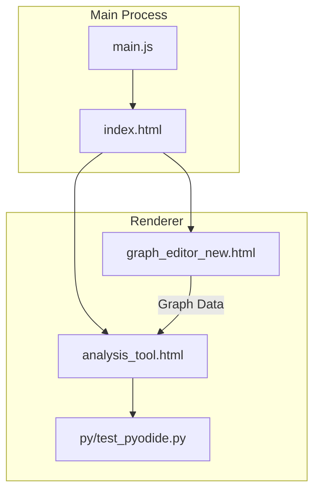

# Electron-App

This repository contains a simple Electron-based tool for editing and analyzing causal graphs.

## Architecture

The application is split between a small Electron main process and several HTML pages that run in the renderer. The main process (`main.js`) launches `index.html` and sets up an application menu. The renderer hosts two major interfaces:

- **Graph Editor (`graph_editor_new.html`)** – lets users create and edit nodes and edges using `vis-network`. Graphs can be saved or loaded as JSON files.
- **Analysis Tool (`analysis_tool.html`)** – loads the editor's graph and runs Python code via Pyodide (`py/test_pyodide.py`) to perform causal analysis with `networkx`.

Data flows from the editor to the analysis tool and into the Python environment. The diagram below shows a high-level view of the components:

Each part communicates via the DOM or IPC-style messaging. The Python script returns JSON-formatted results which are then displayed in the analysis tool.
